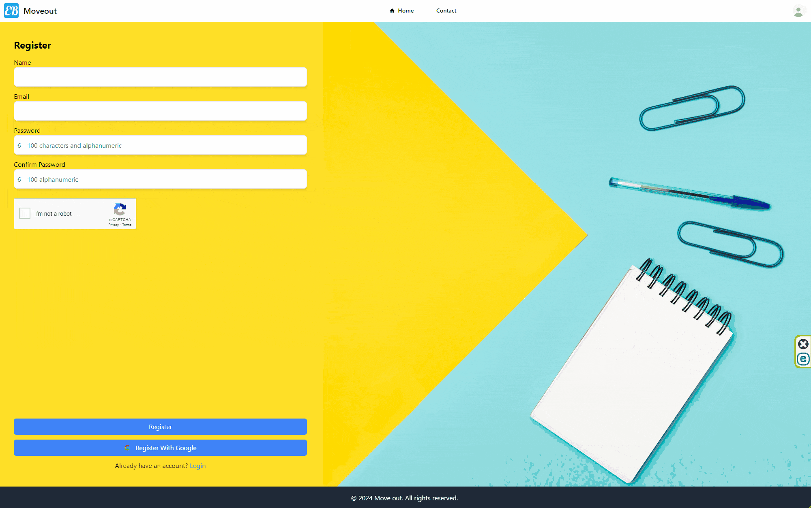
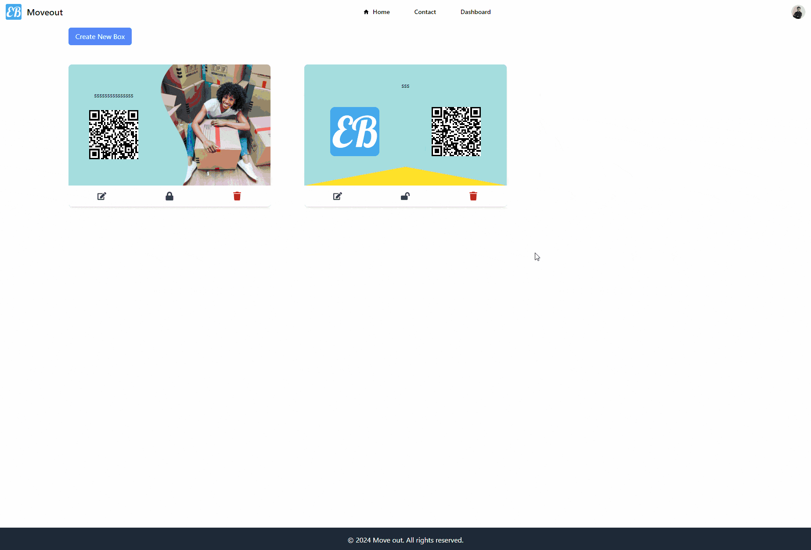
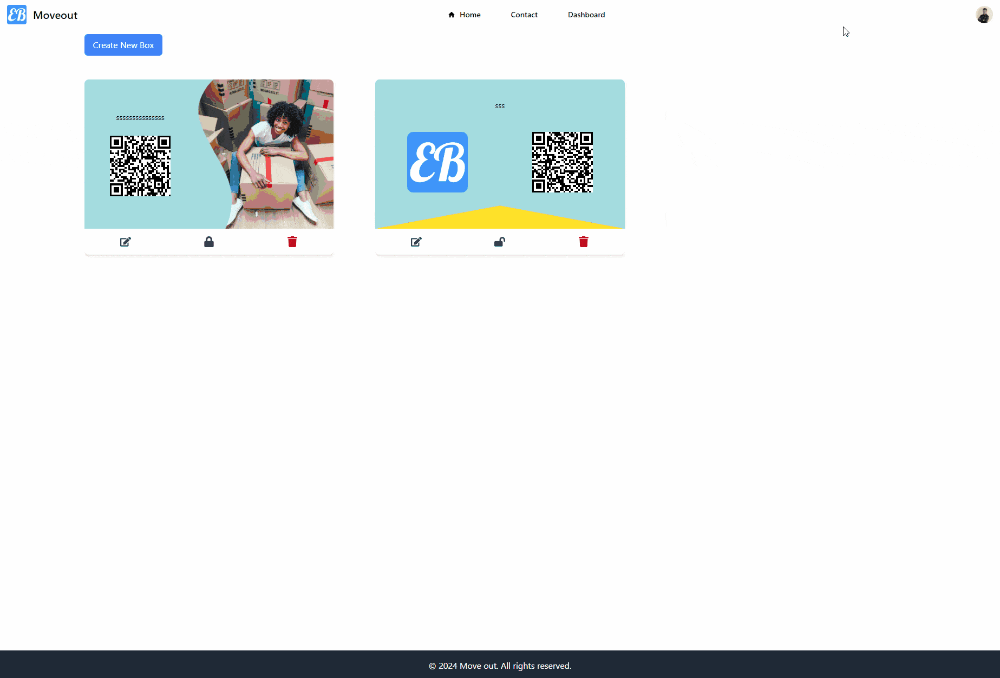
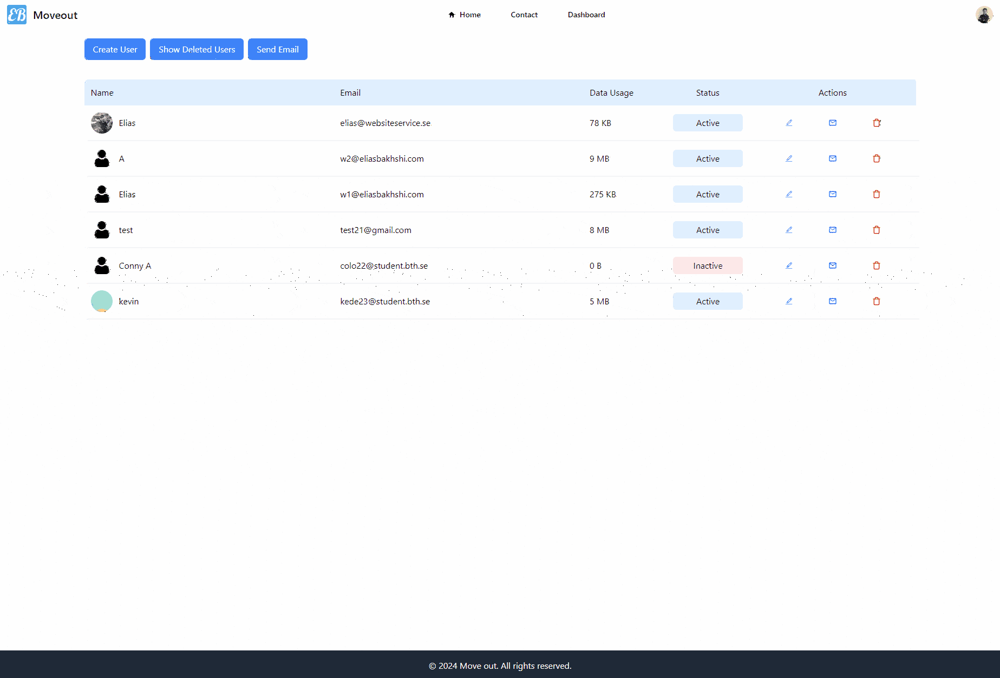

# Moveout

- [Overview](#overview)
- [Requirements](#requirements)
- [Installation](#installation)
- [Scripts](#scripts)
- [Usage](#usage)
- [Contributing](#contributing)
- [License](#license)
- [Contact](#contact)

## Overview

**Moveout** is a MERN web application that help people to organize moving boxes when it is time to move to a new place.

<p>
   
   
   
   
   
   
   
   
   
   
   
   
   
   
   
   
   
   
   
   
</p>

## Requirements

- **Node.js** version 20.17 or higher
- **MongoDB**
- **NPM**

## Installation

1. Clone the repository:

   ```bash
   git clone https://github.com/eliasbakhshi/mern-moveout.git
   ```

2. Navigate to the project directory:

   ```bash
   cd mern-moveout
   ```

3. Make a .env file

   ```bash
   cp .env.production .env
   ```

4. Install the dependencies:

   ```bash
   npm install
   ```

5. Go to the front-end folder:

   ```bash
   cd frontend
   ```

6. Install the dependencies for the front end:

   ```bash
   npm install
   ```

7. Change directory to the back-end folder:

   ```bash
   cd ..
   cd backend
   ```

8. Install the dependencies for the back end:

   ```bash
   npm install
   ```

9. Go back to the root and run the scripts:

   ```bash
   cd ..
   ```

## Scripts

For running both the frontend and backend servers concurrently.

```bash
 npm start
```

This starts the backend server using nodemon.

```bash
 npm run backend
```

This starts the frontend server.

```bash
 npm run frontend
```

## Usage

#### **Registration/Login:**

- Guests can sign up using their email/password or Gmail accounts. An email verification will be sent to guests's email to verify their email if they register with the registration form.
- The email should be verified first to be able to login to the application. If the user login with the Gmail their email will be verified.
- when users login with Gmail, their avatar will be replaced on the user's account if they have no picture uploaded as profile picture.
- Guests can reset their password and request a new verification email.
- Users who are not active for 3 weeks will receive a reminder email to log in to the web application to renew their activation time. If they do not log in, their account will be deactivated the week after (one month after the last activity).



#### **Boxes and Items:**

- Users can manage all kinds of digital boxes with customized items related to specific types.
- Users can share boxes with other registered users, and the information about the shared boxes will be sent to the recipient's email.
- There are two types of boxes: standard and insurance with different items types and views.


#### **Labels:**

- Users can share the label with other registered users.
- Users can download the label in PDF form.



#### **Profile:**

- Users can view and manage their profiles.
- Users can deactivate and activate their accounts. Upon deactivation, an email will be sent to the user.
- Users can soft delete their accounts after deactivating. An email will be sent to the user to confirm the deletion.
- If the user is deactivated, they can only visit the profile page and not other pages that require users to be logged in.



#### **Users List:**

- Admins can manage users and soft delete or delete users.
- Users created by admins can log in to the app without verifying their email.
- Admins can see a list of registered users, a list of deleted users, and how much space they have used.
- Admins can send marketing emails to all users or just selected users.



#### **Box-Details:**

- Guests can only view the box details (items) by scanning the QR code. If the box is private, they must enter a 6-digit code before visiting the page.

## Contributing

Contributions are welcome! Please follow these steps:

1. **Fork the Repository** (if you haven’t already) by going to the main repository on GitHub and clicking the “Fork” button at the top-right of the page.

2. **Create a Feature Branch**

   ```bash
   git checkout -b feature/YourFeature
   ```

3. **Commit Your Changes**

   ```bash
   git commit -m 'Add Your Feature'
   ```

4. **Push to the Branch**

   ```bash
   git push origin feature/YourFeature
   ```

5. **Send a poll request**

## License

This project is licensed under the MIT License. See the [LICENSE](LICENSE) file for details.

## Contact

- **Email:** Bakhshielias@gmail.com
- **LinkedIn:** [Elias Bakhshi](https://www.linkedin.com/in/eliasbakhshi)
- **GitHub:** [EliasBakhshi](https://github.com/eliasbakhshi)
